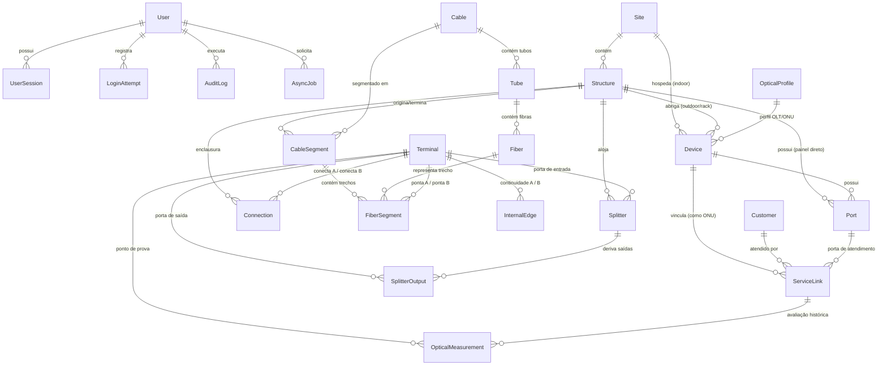

# Modelo Entidade-Relacionamento e Topologia Óptica

Este documento detalha o modelo de dados relacional e espacial do **FTTH Manager**, cobrindo todas as entidades do banco de dados relacional PostgreSQL/PostGIS, restrições de integridade, convenções de unidades físicas e o grafo topológico óptico.

---

## 1. Visão Geral da Arquitetura de Dados

O modelo de dados foi projetado sobre os seguintes pilares:
1. **Normalização Rigorosa**: Grafo óptico modelado no nível de portas, terminais físicos e conexões com continuidade determinística.
2. **Modelo de Terminais $2N$**: Cada segmento de fibra, porta de equipamento ou splitter possui terminais ópticos explícitos e normalizados (`kind="port_front"`, `"fiber_endpoint"`, `"splitter_input"`, `"splitter_output"`).
3. **Geometria Espacial Geodésica**: Coordenadas em WGS84 (EPSG:4326) indexadas via GiST, com cálculo de distâncias elipsoidais via fórmula de Haversine e PostGIS `ST_Distance(..., use_spheroid=true)`.
4. **Concorrência Otimista com If-Match**: Todas as entidades herdam de `VersionedModelMixin`, com coluna `version` inteira e cabeçalhos HTTP `If-Match` para prevenir sobrescritas acidentais (RFC 7232).
5. **Revisão Topológica Monotônica**: Controle de concorrência e invalidação de cache de rascunhos de fusão e simulação via `NetworkTopologyState.topology_revision`.
6. **Unidades Físicas Explícitas**: Convenção estrita de sufixos de grandeza no schema (`*_m` para metros, `*_db` para dB, `*_dbm` para dBm, `wavelength_nm` para nanômetros).

---

## 2. Diagrama Entidade-Relacionamento (Mermaid)



---

## 3. Dicionário de Domínios e Entidades

### 3.1. Identidade, Segurança e Sessões (`identity`)
- **`User` (`users`)**: Contas de operadores e administradores com perfis RBAC (`admin`, `engineer`, `technician`, `viewer`). Senhas armazenadas com hash Argon2id (RFC 9106).
- **`UserSession` (`user_sessions`)**: Sessões ativas de navegação com tokens opacos criptograficamente seguros (SHA-256 no banco), expiração absoluta (7 dias) e inatividade (24 horas).
- **`LoginAttempt` (`login_attempts`)**: Registro distribuído de tentativas de login para rate-limiting distribuído (máximo 5 tentativas consecutivas por IP/e-mail em 15 minutos).

### 3.2. Inventário Físico e Espacial (`inventory`)
- **`Site` (`sites`)**: Instalações de grande porte (POP, Central Office, Datacenter). Geometria pontual PostGIS `Point(lon, lat)` EPSG:4326.
- **`Structure` (`structures`)**: Estruturas físicas pontuais da planta externa (Poste, CEO, CTO, Rack, Caixa Subterrânea).
  - Restrição: Coordenadas geodésicas obrigatórias e código unívoco (`code`).
- **`Device` (`devices`)**: Equipamentos ativos ou passivos de rede (OLT, ONU, DIO, Switch).
  - Restrição de Integridade (`chk_device_single_location`): O dispositivo deve pertencer exclusivamente a um `Site` **OU** a uma `Structure`, nunca a ambos nem a nenhum.
- **`Port` (`ports`)**: Portas físicas ópticas ou elétricas (`pon`, `client_drop`, `uplink`, `ethernet`).
  - Restrição de Integridade (`chk_port_single_owner`): Pertence exclusivamente a um `Device` **OU** a uma `Structure` (ex: porta direta de painel CTO).

### 3.3. Cabos e Fibras Ópticas (`cables`)
- **`Cable` (`cables`)**: Bobina ou modelo de cabo óptico (código, modelo, contagem de fibras, padrão de cores ABNT/TIA/DIN).
- **`Tube` (`tubes`)**: Tubo loose numerado dentro do cabo com nome e código de cor.
- **`Fiber` (`fibers`)**: Fibra óptica individual contida no tubo.
- **`CableSegment` (`cable_segments`)**: Trecho físico contínuo de cabo instalado entre duas estruturas.
  - Geometria: `LineString` PostGIS EPSG:4326.
  - Comprimento: `map_length_m` (geodésico calculado) e `effective_length_m` (com folgas técnicas e sobras).
  - Restrição de Integridade: Origem e destino devem ser estruturas distintas com geometria compatível.
- **`FiberSegment` (`fiber_segments`)**: Trecho de uma fibra óptica específica em um `CableSegment`, delimitado por `terminal_a_id` e `terminal_b_id`.

### 3.4. Conectividade e Grafo Óptico (`connectivity`)
- **`Terminal` (`terminals`)**: Ponto de conexão óptica elementar normalizado no modelo $2N$.
  - Tipos (`kind`):
    - `port_front`: Interface frontal de uma porta OLT, DIO, ONU ou CTO.
    - `fiber_endpoint`: Extremidade de uma fibra óptica em uma estrutura.
    - `splitter_input`: Porta de entrada de um splitter passivo.
    - `splitter_output`: Porta de saída de um splitter passivo.
  - Estados: `occupancy` (`free`, `connected`, `reserved`, `damaged`).
- **`Connection` (`connections`)**: Acoplamento óptico físico entre dois terminais.
  - Tipos: `fusion` (fusão por fusão a arco voltaico, perda padrão 0.10 dB) e `patchcord` (cordão óptico / acoplador, perda padrão 0.30 dB a 0.50 dB).
  - Flag de atividade: `is_active` (permite desativação e auditoria sem deleção física imediata).
- **`InternalEdge` (`internal_edges`)**: Continuidade interna de fibra que atravessa uma caixa de emenda direto sem fusão (pass-through / sangria).
- **`Splitter` (`splitters`)**: Divisor óptico passivo balanceado (1:2, 1:4, 1:8, 1:16, 1:32) ou assimétrico/desbalanceado (1:2 com razões 10/90, 20/80, 50/50).
  - Possui terminal de entrada obrigatório (`input_terminal_id`).
- **`SplitterOutput` (`splitter_outputs`)**: Cada uma das $N$ portas de saída com `nominal_loss_db` teórico e `measured_loss_db` calibrado.

### 3.5. Assinantes e Atendimento (`customers`)
- **`Customer` (`customers`)**: Assinante ou pessoa jurídica atendida pelo provedor (código, razão social, endereço, telefone).
- **`ServiceLink` (`service_links`)**: Vínculo operacional entre Cliente, Porta de Atendimento da CTO e Dispositivo ONU.
  - Restrição de Integridade: Apenas 1 atendimento `active` por porta CTO e apenas 1 atendimento `active` por equipamento ONU simultaneamente (índices únicos parciais no PostgreSQL).

### 3.6. Orçamento Óptico e Medições (`optical` e `measurements`)
- **`OpticalProfile` (`optical_profiles`)**: Especificação de tecnologia óptica (GPON, XGS-PON, EPON, P2P) com comprimentos de onda, potência de transmissão ($TX_{min}$, $TX_{max}$), limites de recepção ($RX_{sensibilidade}$, $RX_{sobrecarga}$) e margens de engenharia.
- **`OpticalMeasurement` (`optical_measurements`)**: Medição pontual de potência óptica de campo (Power Meter / OTDR) associada a um terminal e a um atendimento, com cálculo automático de perda em excesso (`excess_loss_db = predicted_rx_dbm - power_dbm`).

### 3.7. Anexos, Auditoria e Operações Assíncronas
- **`Attachment` (`attachments`)**: Arquivo ou foto anexada a um recurso (Poste, CEO, CTO, Medição), validada por hash SHA-256 e magic bytes MIME.
- **`AuditLog` (`audit_logs`)**: Trilha de auditoria append-only com `action`, `user_id`, `resource_type`, `resource_id`, snapshot antes e depois (`state_before`, `state_after`).
- **`AsyncJob` (`async_jobs`)**: Processamento em segundo plano para exportação GeoJSON/CSV, cálculo de rotas pesadas e importações com suporte a progresso percentual e idempotência.

---

## 4. Semântica do Grafo Óptico

A propagação óptica no grafo segue regras estritas de física e topologia:

```
[Porta OLT PON] 
       │ (patchcord)
[Terminal Ponta A Feeder]
       │ (trecho de fibra no cabo alimentador)
[Terminal Ponta B Feeder]
       │ (fusão)
[Splitter IN - CEO]
       │ (divisão óptica 1:N)
[Splitter OUT #1 - CEO]
       │ (fusão)
[Terminal Ponta A Distribuição]
       │ (trecho de fibra no cabo de distribuição)
[Terminal Ponta B Distribuição]
       │ (fusão)
[Splitter IN - CTO]
       │ (divisão óptica 1:N)
[Splitter OUT #1 - CTO]
       │ (fusão)
[Porta Atendimento CTO]
       │ (cordão de drop óptico)
[Porta Óptica ONU (RX)]
```

### Regras de Travessia
1. **Downstream (OLT $\to$ Assinante)**:
   - Sinal óptico ingressa no terminal de entrada do splitter e ramifica-se deterministicamente para **todas** as portas de saída.
   - Saídas irmãs do mesmo divisor nunca propagam sinal entre si.
2. **Upstream (Assinante $\to$ OLT)**:
   - Sinal óptico entra por uma porta de saída do splitter e converge **exclusivamente** para a porta de entrada.
   - Não há reflexão nem transmissão lateral para outras portas de saída.
3. **Detecção de Anomalias**:
   - Pontas abertas sem continuidade são sinalizadas como `unresolved_terminals`.
   - Conexões simultâneas concorrentes na mesma porta física são marcadas como `ambiguous`.
   - Loops físicos incorretos são interrompidos com detecção de ciclo (`cycle_detected`).
